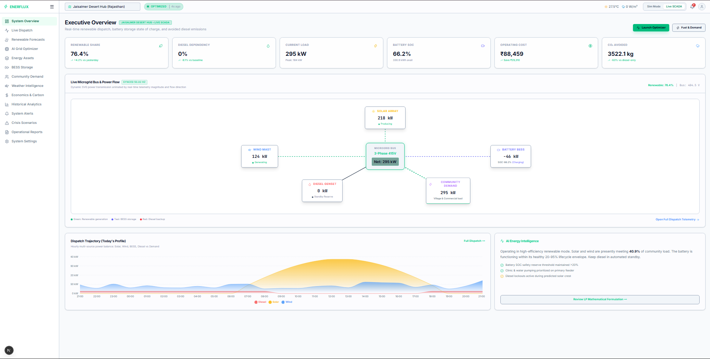
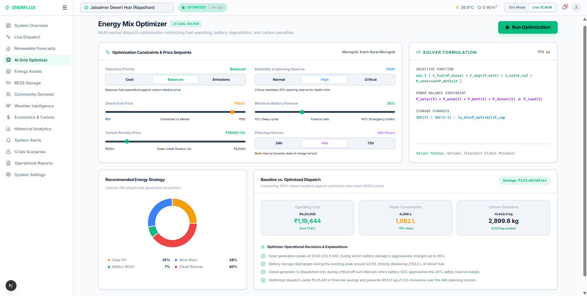
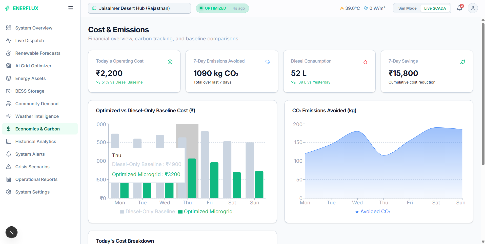
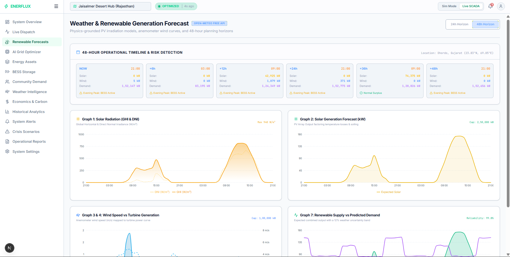
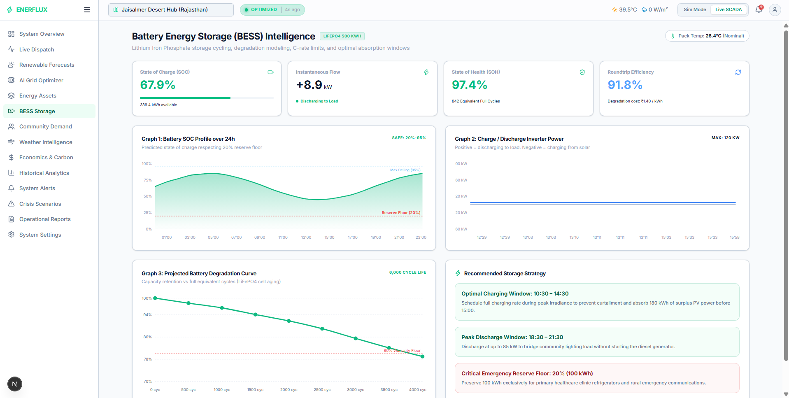
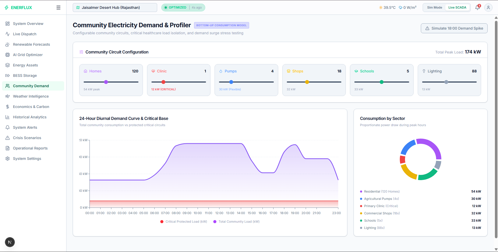

⭐ ENERFLUX
📌 Project Overview
ENERFLUX is an intelligent Microgrid SCADA dashboard and Linear Programming (LP) optimization platform. 
The system simulates how a smart microgrid manages various power sources (Solar, Wind, Battery Energy Storage, and Diesel Generators) to serve community loads efficiently.
This project demonstrates key microgrid management concepts including:
- Real-Time SCADA Telemetry
- Renewable Energy Forecasting
- Battery Energy Storage System (BESS) Management
- Diesel Generator Dispatch
- Cost and Carbon Optimization
- Live Weather Data Integration

The goal of this project is to showcase how AI and mathematical optimization can reduce costs and minimize carbon emissions in off-grid or rural networks. 

This project is suitable for:
- Academic demonstrations in renewable energy
- Hackathon submissions (Built for HackOut'26)
- Energy optimization learning
- Full-stack system design practice

🎯 Project Objective
The main objective of this project is to demonstrate how intelligent software can autonomously dispatch energy resources in an off-grid network. 
The project shows the complete lifecycle of grid optimization:
Weather Forecast → Solar/Wind Estimation → Load Demand Analysis → Linear Programming Optimization → Asset Dispatch → Cost/CO2 Reporting

The system highlights how this platform improves:
- Energy cost reduction
- Carbon footprint minimization
- Battery health preservation
- Grid reliability and operational efficiency

🛠 Technology Stack
Frontend
- React (Next.js)
- TailwindCSS
- Recharts (for telemetry graphs)
- Axios

Backend
- Python
- FastAPI
- PuLP (Mathematical Optimization Engine)
- Uvicorn

Architecture
- REST API Architecture
- Decoupled Frontend and Backend Applications
- Mathematical Optimization Layer

🏗 System Architecture
The application follows a modular full-stack architecture. 
The backend provides high-performance REST APIs powered by FastAPI and PuLP, and the Next.js frontend consumes these APIs to display live telemetry and manage grid settings. 
This architecture ensures:
- Real-time data processing
- Scalability
- Clean code organization
- Separation of concerns

📂 Project Folder Structure
backend/
  routers/
  services/
  models/
  main.py
frontend/
  src/
    app/
    components/
    contexts/
    lib/
optimization/
data/

👤 User Roles
The system simplifies grid access into three major roles.

🧑💼 Grid Operator
The Grid Operator handles operational activities related to dispatching and monitoring.
Responsibilities
- Monitor live SCADA telemetry
- Override automated dispatch (e.g., force start diesel generator)
- Check battery state of charge (SOC)
- Monitor weather warnings and alerts
Modules Accessible
- Alerts
- Assets
- Battery
- Demand
- Dispatch
- Weather

💰 Financial Auditor
The Financial Auditor manages financial metrics and energy market pricing.
Responsibilities
- Monitor daily and monthly energy costs
- Track diesel fuel expenses based on localized pricing
- Generate cost vs. savings reports
- Evaluate carbon credits (CO₂ Avoided)
Modules Accessible
- Analytics
- Cost
- Reports

🛡 System Administrator
The Admin has full system access to configure the underlying AI models.
Responsibilities
- Access all modules
- Adjust optimization scenarios and constraints
- Modify fuel prices and grid parameters
- Hot-swap geographic microgrid profiles (e.g., Kutch Desert vs Spiti Valley)

🔄 Core Optimization Workflow
The system demonstrates the complete lifecycle of a smart microgrid decision.

Step 1 – Data Ingestion
System pulls live weather forecasts (Open-Meteo) and real-time load demand.
Step 2 – Generation Estimation
Calculates expected Solar and Wind output based on irradiance and wind speed.
Step 3 – Battery Health Check
System checks the current State of Charge (SOC) of the Battery Energy Storage System.
Step 4 – Mathematical Optimization
PuLP Linear Programming engine calculates the most cost-effective dispatch strategy, balancing the grid equation.
Step 5 – Dispatch Execution
Automated signals are generated to charge/discharge the battery or start the diesel generator.
Step 6 – SCADA Update
Frontend animated transmission diagrams update to reflect live power flows.
Step 7 – Cost Calculation
Financial metrics are updated using localized fuel prices.
Step 8 – Alert Generation
AI generates preemptive alerts for operators (e.g., expected cloud cover, high load anomalies).

🧩 Major Modules
SCADA & Telemetry Module
Displays animated, real-time power flows between assets.
Optimization Module
Showcases the linear programming breakdown and algorithm decisions.
Settings & Configuration Module
Manages geographic microgrid profiles and live local diesel pricing.
Weather & Forecasting Module
Integrates 48-hour environmental data to predict solar output.
Cost & Analytics Module
Tracks "Renewable Share", "Diesel Dependency", and "CO₂ Avoided" metrics.
Alerts Module
Dynamic alert generation based on live data anomalies and optimization events.

📊 Dashboard Design
Grid Operator Dashboard
Displays:
- Live Power Flows (kW)
- Battery SOC (%)
- Renewable Share
- Weather Alerts
Financial Dashboard
Displays:
- Total Operating Cost
- Diesel Expenses
- Estimated Savings vs Baseline
- CO₂ Emissions Avoided

🚀 Installation Guide
Clone the Repository
To get a local copy of the project, clone the repository from GitHub and navigate into the project directory.
git clone https://github.com/yakshvachhanis/hackout26_project.git
cd hackout26_project

Backend Setup
cd backend
python -m venv venv
# Windows: venv\Scripts\activate
# Mac/Linux: source venv/bin/activate
pip install fastapi uvicorn pulp pandas
python -m uvicorn main:app --reload --port 8000

Frontend Setup
cd frontend
npm install
npm run dev

View the App
Open http://localhost:3000 in your browser.

📸 Screenshots

### Homepage / Live SCADA

### Optimizer Breakdown

### Cost Analytics

### Weather Integration

### Battery Management

### Demand Analysis

👨💻 Team Members
Daksh Kevadiya - GitHub Profile: https://github.com/dakshkevadiya
Yaksh Vachhani - GitHub Profile: https://github.com/yakshvachhanis
Pal Patel - GitHub Profile: https://github.com/pal0611
Dhruvi Ambaliya - GitHub Profile: https://github.com/dhruvi544

🎓 Project Usage
This project can be used for:
- Microgrid dispatch demonstrations
- Hackathon projects
- Software engineering learning
- Applied linear programming practice

🔮 Future Improvements
Possible future enhancements include:
- Real-time IoT sensor integration (Modbus/MQTT)
- AI-based deep learning demand forecasting
- Advanced multi-node grid topologies
- Cloud deployment (AWS/GCP)
- Mobile application support

📄 License
This project is developed for HackOut'26 and educational purposes. See the LICENSE file for details.
